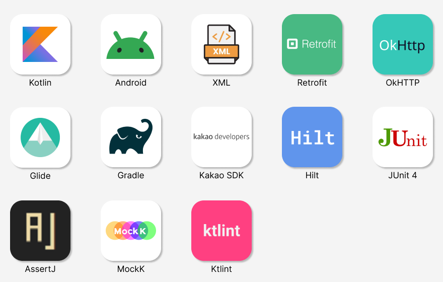
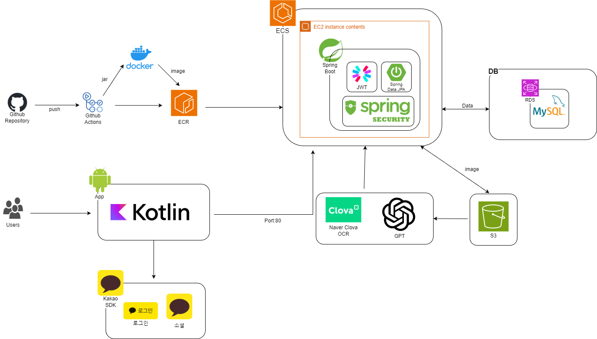

# KAPP짱 - 正산
우리 모임의 지출 관리를 쉽고 편하게!


## 기획 의도
> 正산은 여행, 동호회 등 다양한 모임에서 발생하는 복잡한 정산 과정을 간편하게 해결해주는 서비스입니다. 기존의 유사 서비스들이 모임 내 지출 금액을 단순히 1/N로 나누는 기능만 제공하는 데 반해, 저희 서비스는 **OCR 기술**을 통해 모임에서 발생한 지출 영수증의 소비된 상품명과 수량을 자동으로 추출하여 **사용자가 실제 소비한 내역을 직접 선택할 수 있는 기능을 지원**합니다. 이를 통해 실제 소비 내역을 기반으로 한 세부적인 정산이 가능합니다. **正산**은 모임 내 정산을 더욱 편리하고 정확하게 만들어 사용자에게 차별화된 정산 경험을 제공합니다.

## Deploy Link
> Backend: [Swagger API](http://ecs-alb-50894514.ap-northeast-2.elb.amazonaws.com/swagger-ui/index.html)
>
> Android: [ONEstore](https://m.onestore.co.kr/ko-kr/apps/appsDetail.omp?prodId=0000779533)

## Contributors

<!-- ALL-CONTRIBUTORS-LIST:START - Do not remove or modify this section -->
<!-- prettier-ignore-start -->
<!-- markdownlint-disable -->
<table>
  <tbody>
    <tr>
      <td align="center">
        <b>Android</b><br />
      </td>
      <td align="center">
        <b>Android</b><br />
      </td>
      <td align="center">
        <b>Android</b><br />
      </td>
    </tr>
    <tr>
      <td align="center" valign="top" width="14.28%">
        <a href="https://github.com/jsh00325"><br /><sub><b>정수현</b></sub></a><br />
        <a href="https://github.com/kakao-tech-campus-2nd-step3/Team23_Android/commits?author=jsh00325" title="Code">💻</a>
        <a href="https://github.com/kakao-tech-campus-2nd-step3/Team23_Android/pulls?q=is%3Apr+reviewed-by%3Ajsh00325" title="Reviewed Pull Requests">👀</a>
      </td>
      <td align="center" valign="top" width="14.28%">
        <a href="https://github.com/ksc1008"><br /><sub><b>권성찬</b></sub></a><br />
        <a href="https://github.com/kakao-tech-campus-2nd-step3/Team23_Android/commits?author=ksc1008" title="Code">💻</a>
        <a href="https://github.com/kakao-tech-campus-2nd-step3/Team23_Android/pulls?q=is%3Apr+reviewed-by%3Aksc1008" title="Reviewed Pull Requests">👀</a>
      </td>
      <td align="center" valign="top" width="14.28%">
        <a href="https://github.com/cleonno3o"><br /><sub><b>주수민</b></sub></a><br />
        <a href="https://github.com/kakao-tech-campus-2nd-step3/Team23_Android/commits?author=cleonno3o" title="Code">💻</a>
        <a href="https://github.com/kakao-tech-campus-2nd-step3/Team23_Android/pulls?q=is%3Apr+reviewed-by%3Acleonno3o" title="Reviewed Pull Requests">👀</a>
      </td>
    </tr>
  </tbody>
</table>

<table>
  <tbody>
    <tr>
      <td align="center">
        <b>Backend</b><br />
      </td>
      <td align="center">
        <b>Backend</b><br />
      </td>
      <td align="center">
        <b>Backend</b><br />
      </td>
      <td align="center">
        <b>Backend</b><br />
      </td>
    </tr>
    <tr>
      <td align="center" valign="top" width="14.28%">
        <a href="https://github.com/us4c0d3"><br /><sub><b>장우석</b></sub></a><br />
        <a href="https://github.com/kakao-tech-campus-2nd-step3/Team23_BE/commits?author=us4c0d3" title="Code">💻</a>
        <a href="https://github.com/kakao-tech-campus-2nd-step3/Team23_BE/pulls?q=is%3Apr+reviewed-by%3Aus4c0d3" title="Reviewed Pull Requests">👀</a>
      </td>
      <td align="center" valign="top" width="14.28%">
        <a href="https://github.com/minju26"><br /><sub><b>김민주</b></sub></a><br />
        <a href="https://github.com/kakao-tech-campus-2nd-step3/Team23_BE/commits?author=minju26" title="Code">💻</a>
        <a href="https://github.com/kakao-tech-campus-2nd-step3/Team23_BE/pulls?q=is%3Apr+reviewed-by%3Aminju26" title="Reviewed Pull Requests">👀</a></td>
      <td align="center" valign="top" width="14.28%">
        <a href="https://github.com/Lucerna00"><br /><sub><b>박준석</b></sub></a><br />
        <a href="https://github.com/kakao-tech-campus-2nd-step3/Team23_BE/commits?author=Lucerna00" title="Code">💻</a>
        <a href="https://github.com/kakao-tech-campus-2nd-step3/Team23_BE/pulls?q=is%3Apr+reviewed-by%3ALucerna00" title="Reviewed Pull Requests">👀</a>
      </td>
      <td align="center" valign="top" width="14.28%">
        <a href="https://github.com/dkswoals"><br /><sub><b>안재민</b></sub></a><br />
        <a href="https://github.com/kakao-tech-campus-2nd-step3/Team23_BE/commits?author=dkswoals" title="Code">💻</a>
        <a href="https://github.com/kakao-tech-campus-2nd-step3/Team23_BE/pulls?q=is%3Apr+reviewed-by%3Adkswoals" title="Reviewed Pull Requests">👀</a>
      </td>
    </tr>
  </tbody>
</table>
<!-- markdownlint-restore -->
<!-- prettier-ignore-end -->
<!-- ALL-CONTRIBUTORS-LIST:END -->


---

## 구현 기능
|팀원|담당 파트|
|---|---|
|권성찬|지출 목록 조회, 지출 상세 내역 조회, 지출 추가, 카메라 촬영 및 OCR 전송 UI 구현   <br> 지출 목록 조회, 지출 상세 내역 조회, 지출 정보 추가 및 수정 관련 도메인, 데이터 로직 구현<br>CI 스크립트 구현|
|주수민|*|
|정수현|메인 페이지, 지출 내역 페이지 UI 구현 <br> 카카오톡을 통한 송금 요청, 새 지출 등록 알림 메시지 전송 기능 구현 <br> 서버 로그인, 사용자 정보 관련 도메인, 데이터 로직 구현|

### [User 관련]

- **로그인 & 회원가입**
    - 카카오 API를 통한 카카오 로그인 기능
    - 서비스 서버에서 로그인 및 회원가입 후 토큰 발급 및 저장
    - 저장된 토큰으로 자동 로그인 기능 지원
        

### [Expense 관련]

- **지출 내역 등록**
    - 영수증 촬영 또는 수기 입력을 통한 지출 상세 내역 등록
    - 카테고리 선택(Dialog) 기능 제공
    - 영수증 인식 시 잘못 인식된 정보 수정 가능
- **지출 목록 조회**
    - 진행 상태별(정산 중, 송금 대기, 송금 완료)로 지출 목록 분류
    - 본인이 등록한 지출 여부 확인 기능
    - 정산 중인 지출의 경우, 해당 지출의 확인 여부 표시 기능
- **개인 소비 내역 저장 및 수정**
    - 등록된 지출 내역 중 개인 소비 항목 선택 및 저장
    - 기존 소비 내역 수정 기능 제공
- **지출 선택 현황 확인**
    - 내가 등록한 지출에 대해 다른 모임원의 소비 내역 확인 가능
    - 모임원의 소비 내역을 검토 후, 상태를 `정산 중` ↔ `송금 대기`로 전환 가능
- **송금 요청**
    - 내가 등록한 지출에 대한 다른 모임원들의 송금할 금액 조회 기능
    - 카카오톡 메시지를 통한 송금 요청 메시지 전송 기능
    - *(요청 메시지의 링크를 통해 카카오페이 송금으로 연결되는 기능)*
        - 송금 링크 생성을 위해서는 카카오페이 디벨로퍼 사업자 등록 필요로 인해 구현하지 못함

### [Group 관련]

- **모임 생성**
    - 카카오 친구 선택을 통한 모임 생성
    - 모임원에게 초대 메시지 전송 기능 포함
- **모임 조회**
    - 진행 중인 모임과 완료된 모임 목록 조회 기능
- **모임 초대 메시지 전송**
    - 모임 생성 시 카카오톡 초대 메시지 전송
    - 초대 링크를 통해 앱 내 모임 참여 가능
    - `모임 > 초대 현황`에서 가입하지 않은 모임원에게 초대 메시지 재전송
- **모임 관리**
    - `모임 > 모임 종료` 클릭 시 모임을 완료 상태로 변경
- **모임원 카카오 ID 조회**
    - 모임원의 카카오 ID를 조회하여 친구 목록과 대조 후 UUID 획득
    - 획득한 UUID로 카카오톡 메시지 전송 가능

### [Ocr 관련]

- **영수증 내용 분석**
    - 촬영한 영수증을 서버로 전송하여 지출 상세 정보를 자동 추출 및 표시

---

## 🎞️ 데모 영상 & 기능 설명

https://github.com/user-attachments/assets/1928d49c-d904-43af-b25c-588098ecb733

### 로그인 & 그룹 생성
- 카카오 계정으로 서비스에 로그인할 수 있습니다. 카카오 기능은 `KakaoClientApi`를 이용하며, API 내부적으로 구현된 인증 절차를 거칩니다. 서비스 서버의 경우 `JWT`를 통해 인증하며, 해당 토큰들은 `EncryptedSharedPreferences`에 저장됩니다.
- 첫 모임 목록 페이지에서 새 그룹 만들기 버튼을 눌러 새로운 그룹을 생성할 수 있습니다.
- 생성할 그룹에는 서비스에 가입된 카카오 친구들을 초대할 수 있습니다. 친구피커에서 초대할 인원을 선택 후 모임 생성하기 버튼을 누르면 새 모임이 만들어지고 초대한 친구들에게는 초대 메시지가 전송됩니다.


https://github.com/user-attachments/assets/1783cb53-93b1-4d24-80c6-052b091339b1

### 초대 링크 수신 & 그룹 참여
- 그룹에 초대 받은 멤버는 전달받은 초대 링크를 클릭하여 해당 그룹에 참여할 수 있습니다.


https://github.com/user-attachments/assets/b2cce39f-9364-4419-82ca-a70634b5c0f0

### 지출 내역 직접 입력
- 영수증이 존재하지 않는 등 OCR기능을 사용하지 못하는 경우에는 새로운 지출을 수기로 입력할 수 있습니다.
- 지출 명, 지출 내역, 이미지를 선택하여 새로운 지출을 등록합니다.
- 등록된 지출은 서버에 등록되며, 그룹원들에게 카카오톡 메시지를 통해 새로운 지출의 등록 여부를 자동으로 전달합니다.


https://github.com/user-attachments/assets/0994d120-5f47-44e0-a815-d7da47d94c67

### 영수증 촬영하여 지출 등록
- 상세 내역을 일일이 입력할 필요 없이 영수증을 찍는것 만으로 간편하게 지출을 등록할 수 있습니다.
- 사진을 찍으면 OCR서버로 전송해 NAVER CLOVA OCR로 스캔한 글자 데이터를 GPT를 통해 영수증 데이터로 파싱하여 자동으로 영수증 내역을 인식합니다.


https://github.com/user-attachments/assets/46761e9f-efea-4650-8bb6-0bff96314cfd

### 영수증 내역 확인 & 소비 항목 선택
- 그룹원은 등록된 지출을 확인할 수 있습니다.
- 영수증의 품목 중에서 자신이 소비한 품목, 소비한 수량을 선택하면 이후 개개인이 소비한 수량에 따라 자동으로 금액이 정산됩니다.
- 유저 편의성을 위해 한 번 이상 확인한 지출을 따로 분리할 수 있게 구현하였습니다.
- 자신이 결제한 지출의 경우 결제일자 오른쪽에 'MY' 아이콘, 확인하지 않은 지출의 경우 지출 명 오른쪽에 파란 점을 표시하여 사용자가 식별하기 쉽게 UX를 구성하였습니다.


https://github.com/user-attachments/assets/3b7e0ff0-19f7-4531-bd6d-0c217ed4c3a3

### 지출 알림 메시지
- 새로운 지출이 등록되면 카카오 메시지 API를 통해 그룹원들에게 메시지를 전송합니다.
- 지출 알림 메시지에는 링크가 포함되어 있으며 해당 링크를 클릭하면 딥링크를 통해 등록된 지출 페이지로 바로 이동할 수 있게 구현하였습니다.


https://github.com/user-attachments/assets/0405758d-b54f-4711-a0d6-baa58cfaf977

### 선택한 지출 현황 확인
- 지출을 등록한 결제자는 자신의 지출에서 그룹원들이 선택한 현황을 조회할 수 있습니다.


https://github.com/user-attachments/assets/f721366b-b973-408e-a332-284d17257f97

### 지출 상태 전환
- 지출 목록은 세 가지 탭으로 구성됩니다.
  - 현재 그룹원들이 발생한 지출을 확인하며 자신의 소비 내역을 선택할 수 있는 `정산 중` 상태
  - 모든 그룹원이 선택이 끝나고, 결제자가 선택 현황을 최종 확인한 후 송금 요청할 수 있는 `송금 대기` 상태
  - 송금 요청이 끝난 지출들이 기록되어 있는 `송금 완료` 상태
- 결제자는 멤버들의 선택 내역을 확인할 수 있으며, 자신의 지출을 `정산 중`이나 `송금 대기` 상태로 전환할 수 있습니다.


https://github.com/user-attachments/assets/e5da715b-1a3b-4594-9c85-5885f7fc2d19

### 송금 요청
- 화면 내 '₩' 플로팅 액션 버튼을 누르면 송금 요청 페이지로 이동됩니다.
- 송금 요청 페이지에는 송금 대기에 등록된 각 지출에서 멤버원들이 선택한 내역을 확인하여 자동으로 멤버들에게 송금받을 금액을 계산하여 알려줍니다.
- 송금 요청하기 버튼을 누르면 해당 멤버에게 송금 받을 사람의 이름과, 송금 받을 금액이 포함된 송금 요청 메시지를 자동으로 보냅니다.
- 정상적으로 메시지를 송신하고 나면 송금 요청이 끝난 지출은 자동으로 `송금 완료` 상태로 전환됩니다.


---

## Project Architecture
### Tech Stack
#### Android

```text
- Language: Kotlin 1.9.0
- Minimum SDK: 26 (Android 8.0)
- Target SDK: 34 (Android 14)
```

### Module Structure
```text
📦23조 正산 - Android Module Structure
├─🟢app				
├─🔵common
│  ├─🔵androidutil		
│  ├─🔵datastore			
│  ├─🔵dispatcher			
│  ├─🔵kakaoclient		
│  ├─🔵navigation			
│  ├─🔵resource				
│  ├─🔵retrofit				
│  └─🔵util
├─🔵data
│  ├─🔵expense		
│  ├─🔵group			
│  ├─🔵ocr				
│  └─🔵user				
├─🔵domain
│  ├─🔵common-user		
│  ├─🔵expense				
│  ├─🔵group					
│  └─🔵ocr						
└─🟢ui
    ├─🟢addexpense				
    ├─🟢camera						
    ├─🟢creategroup				
    ├─🟢data							
    ├─🟢expensedatail			
    ├─🟢expenselist				
    ├─🟢login							
    ├─🟢main							
    └─🟢sendmessage
```

### ERD


### System Architecture

